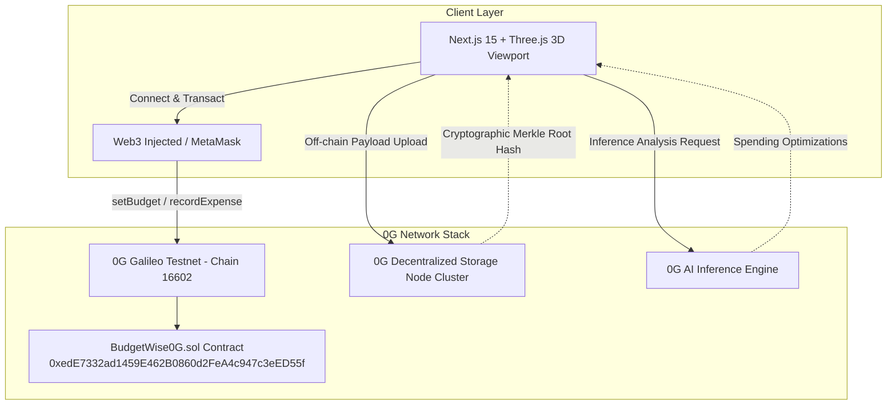

# 🚀 BudgetWise 0G — Autonomous On-Chain Budgeting & 0G Storage Protocol

[-8A2BE2?style=for-the-badge&logo=ethereum)](https://chainscan-galileo.0g.ai/address/0xedE7332ad1459E462B0860d2FeA4c947c3eED55f)
[](https://budgetwise-0g.vercel.app/)
[](https://soliditylang.org/)
[](https://opensource.org/licenses/MIT)

**BudgetWise 0G** is an autonomous, AI-guided on-chain spending guardrail protocol built on the **0G Network**. It pairs ultra-fast EVM budget settlement on 0G Galileo with decentralized off-chain data availability on **0G Storage** via verifiable Merkle root proofs and **0G AI Compute** inference.

Built specifically for the **0G Bridge Buildathon on AKINDO**.

---

### 🌐 Quick Links

- 🔗 **Live Web Application:** [https://budgetwise-0g.vercel.app/](https://budgetwise-0g.vercel.app/)
- 📜 **Deployed Smart Contract:** [`0xedE7332ad1459E462B0860d2FeA4c947c3eED55f`](https://chainscan-galileo.0g.ai/address/0xedE7332ad1459E462B0860d2FeA4c947c3eED55f)
- 🔍 **0G Galileo Explorer:** [View Contract on ChainScan](https://chainscan-galileo.0g.ai/address/0xedE7332ad1459E462B0860d2FeA4c947c3eED55f)
- 📦 **GitHub Repository:** [https://github.com/efekrbas/budgetwise](https://github.com/efekrbas/budgetwise)

---

## 🎯 Key Innovations & Features

1. **Verifiable 0G Storage Receipts (Merkle Proofs):**
   - Full expense payloads, timestamps, and metadata are offloaded to 0G Storage nodes.
   - Only the cryptographic `storageRootHash` is recorded on the 0G Chain to minimize gas costs while guaranteeing 100% data integrity.
   - Built-in interactive **Merkle Proof Inspector** for one-click proof verification.

2. **0G AI Financial Advisor & Inference Engine:**
   - Real-time heuristic and decentralized AI inference engine analyzing spending patterns.
   - Delivers actionable advice on storage batching, compute optimization, and gas savings.

3. **Automated 0G Recurring Streams:**
   - Manage real-time payment streams for 0G node rentals, compute inference pools, and automated relayer fees with instant pause/resume controls.

4. **Cryptographic ZK Audit Exporter:**
   - Generates and exports standardized JSON compliance audit reports with SHA-256 integrity hashes for tax and DAO treasury audits.

5. **0G Network & Node Telemetry Monitor:**
   - Real-time DA bandwidth (50 Gbps+), active storage node cluster health (8/8 online), block latency, and EVM gas telemetry.

---

## 🏗 Modular Architecture



---

## 🛠 Local Development & Deployment

### 1. Clone & Install
```bash
git clone https://github.com/efekrbas/budgetwise.git
cd budgetwise
npm install
```

### 2. Configure Environment
Create a `.env` file in the root directory:
```env
PRIVATE_KEY="your_wallet_private_key"
NEXT_PUBLIC_WC_PROJECT_ID="your_walletconnect_id"
```

### 3. Deploy Contract to 0G Galileo
```bash
npx hardhat compile
npx hardhat run scripts/deploy.js --network 0g-galileo
```

### 4. Run Development Server
```bash
npm run dev
```
Open [http://localhost:3000](http://localhost:3000) to interact with the app.

---

## 💎 Design & Aesthetics
- **WebGL Background:** Ultra-optimized 3D particle terrain built with React Three Fiber (`@react-three/fiber`).
- **Glassmorphism & Bento Grid:** TailwindCSS glass-panel UI with responsive 12-column grid layout.
- **Ecosystem Marquee:** Real-time animated ticker showcasing 0G modular stack features.

---

## 📜 License
Licensed under the [MIT License](LICENSE).
